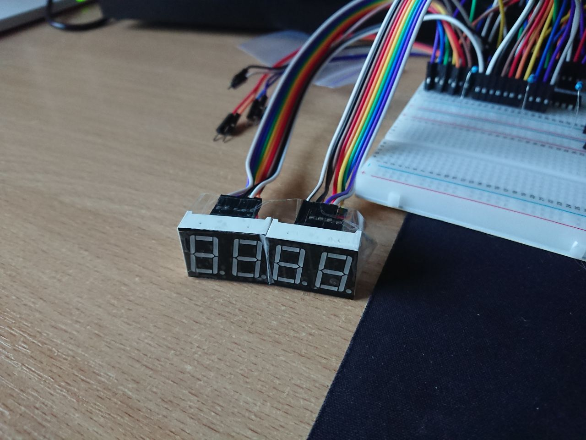

# Driver for the seven-segment display

> This driver also gets unused, as I did the wiring for 7-segments display completely wrong :(

Two of them to be precise.

Works through Texas Instruments 74HC595N
Shift registers, since two 7-segment displays take up 20 pins, and through daisy chaining shift registers together (Qh' output of shift register goes into SER input of the next register), the number of occupied pins can be reduced down to only three, not accounting for 3.3v/ground pins:

- Serial output from mainboard to first shift register
- SRCLK (load data into current bit, and shift it)
- RCLK (output bits from shift register to actual outputs)

Here are some photos of this monstrosity (somewhere in the process of assembling it, I understood just how much space (and possibly time) I could save soldering things together on the solder breadboard):

